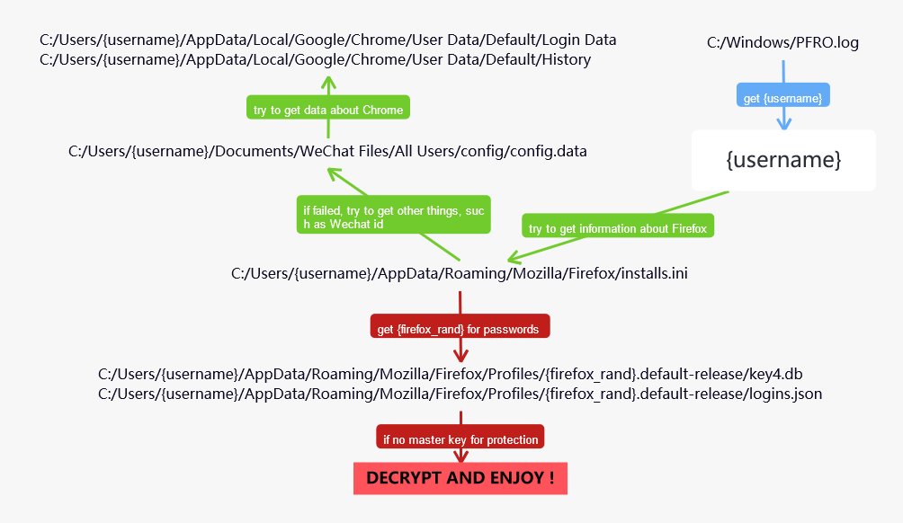
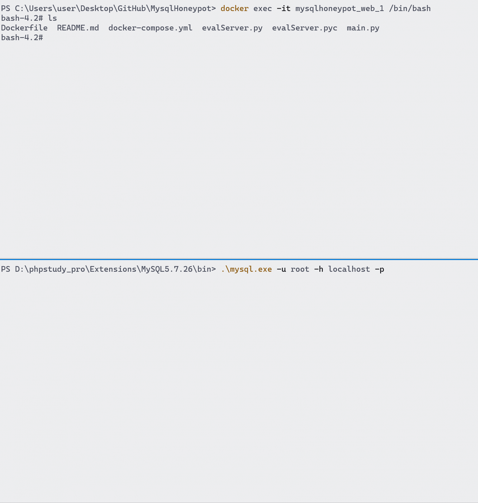

# MysqlHoneypot

一个针对较高版本Firefox密码文件盗取的MYSQL蜜罐。

**Use MySQL honeypot to get something secret, like the passwords stored in Firefox. **

The file *evalServer.py* can run a malicious server, which acts like a MYSQL and can send the payload `load data local infile`.  The program is designed to steal the uninvited guest's passwords stored in Firefox (key4.db and logins.json) without any protection. 

After that, you can use [firepwn](https://github.com/lclevy/firepwd) to decrypt files and get passwords manually if there is no master key for protection!



**Cautions: **To get all things related, an uninvited guest must **interact** with the fake MYSQL server **at least 4 times**! The more the stupid guest interacts with the server, the more information your can get! 

缺陷：在一段时间内仅限于对单个客户端的攻击等。

## Dokcer setup

```bash
docker-compose up -d  # on Linux
docker compose up -d  # on Windows
```

## DEMO

